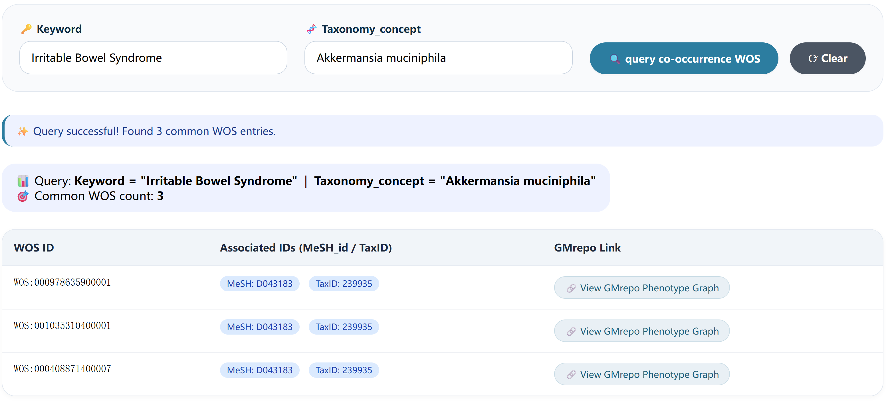

# gut-microbiota-depression-tools
# Gut-Brain Axis Analytics Toolkit

A suite of three interactive, client-side JavaScript tools for exploring associations between gut microbiota, depression, and related phenotypes across published literature and clinical trial registries. All tools run entirely in the browser — no data is uploaded to any server, ensuring complete data privacy and real-time responsiveness.

## 🛠️ Tool Overview

| Tool | File Name | Function | Data Source |
|:---|:---|:---|:---|
| Tool 1 | `Tool1_publication_keyword_co_English_Version_graph_query.html` | Dual-Keyword Literature Co-occurrence Analysis | `Tool1_publications.xlsx` |
| Tool 2 | `Tool2_clinicaltrials_justcoinfo_graph_query.html` | Condition-Intervention Trial Co-occurrence Analysis | `Tool2_clinicaltrials.xlsx` |
| Tool 3 | `Tool3_publication_GMrepo_visiting_En_Version.html` | Keyword-Taxonomy Association with GMrepo Integration | `Tool3_publication_for_GMrepo_query.xlsx` |

## 📸 Tool Previews

### Tool 1 – Literature Co-occurrence

*Example: Akkermansia muciniphila ↔ Inflammation*

### Tool 2 – Clinical Trial Co-occurrence

*Example: Diabetes Mellitus ↔ Fecal Microbiota Transplantation*

### Tool 3 – Keyword-Taxonomy Association

*Example: Akkermansia muciniphila ↔ Irritable Bowel Syndrome*

## 🚀 One-Click Query Links

Click any link below to launch the corresponding tool and automatically execute a pre-defined query.

### Tool 1 – Literature Co-occurrence

- [Akkermansia muciniphila ↔ Inflammation](Tool1_publication_keyword_co_English_Version_graph_query.html?keyword1=Akkermansia%20muciniphila&keyword2=inflammation)
- [Lactobacillus ↔ Depression](Tool1_publication_keyword_co_English_Version_graph_query.html?keyword1=Lactobacillus&keyword2=Depression)
- [Bifidobacterium ↔ Anxiety](Tool1_publication_keyword_co_English_Version_graph_query.html?keyword1=Bifidobacterium&keyword2=Anxiety)
- [Escherichia coli ↔ Stress](Tool1_publication_keyword_co_English_Version_graph_query.html?keyword1=Escherichia%20coli&keyword2=Stress)

### Tool 2 – Clinical Trial Co-occurrence

- [Diabetes Mellitus ↔ Fecal Microbiota Transplantation](Tool2_clinicaltrials_justcoinfo_graph_query.html?condition=Diabetes%20Mellitus&intervention=Fecal%20Microbiota%20Transplantation)
- [Irritable Bowel Syndrome ↔ Probiotic](Tool2_clinicaltrials_justcoinfo_graph_query.html?condition=Irritable%20Bowel%20Syndrome&intervention=Probiotic)
- [Obesity ↔ Prebiotic](Tool2_clinicaltrials_justcoinfo_graph_query.html?condition=Obesity&intervention=Prebiotic)
- [Major Depressive Disorder ↔ Exercise](Tool2_clinicaltrials_justcoinfo_graph_query.html?condition=Major%20Depressive%20Disorder&intervention=Exercise)

### Tool 3 – Keyword-Taxonomy Association

- [Irritable Bowel Syndrome ↔ Akkermansia muciniphila](Tool3_publication_GMrepo_visiting_En_Version.html?keyword=Irritable%20Bowel%20Syndrome&taxon=Akkermansia%20muciniphila)
- [Inflammation ↔ Lactobacillus](Tool3_publication_GMrepo_visiting_En_Version.html?keyword=Inflammation&taxon=Lactobacillus)
- [Obesity ↔ Bifidobacterium longum](Tool3_publication_GMrepo_visiting_En_Version.html?keyword=Obesity&taxon=Bifidobacterium%20longum)
- [Depression ↔ Escherichia coli](Tool3_publication_GMrepo_visiting_En_Version.html?keyword=Depression&taxon=Escherichia%20coli)

## 📖 Usage Guide

### Standard Workflow

1. Launch any tool by clicking the corresponding link in the tool overview table above.
2. The tool will automatically load the underlying dataset from the GitHub repository.
3. Enter your target keywords, conditions, or taxa into the input fields.
4. Click the **Search** or **Analyze** button to execute the query.
5. Results are displayed as interactive tables and knowledge graphs.

### One-Click Query Workflow

1. Click any of the pre-configured query links in the **"One-Click Query Links"** section above.
2. The page will launch with all parameters pre-filled and the query automatically executed.
3. No manual input is required — results appear immediately after data loading.

### Custom Query URLs

Construct your own query URLs using the following parameter schemas:

**Tool 1 – Literature Co-occurrence**
